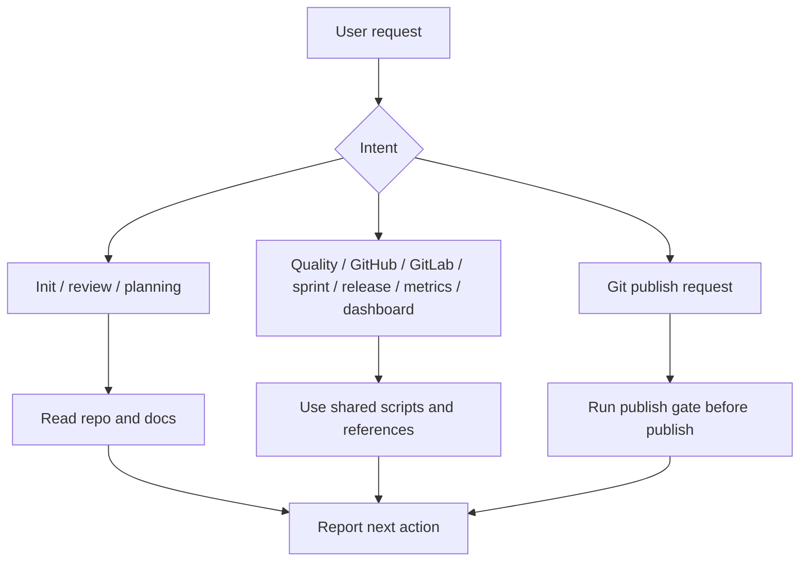
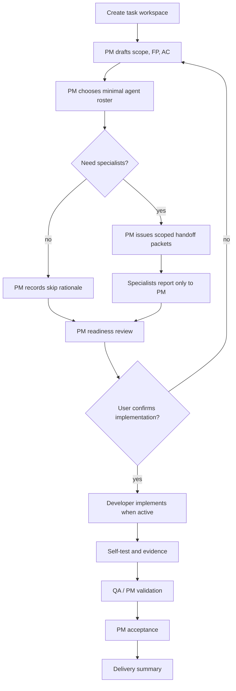
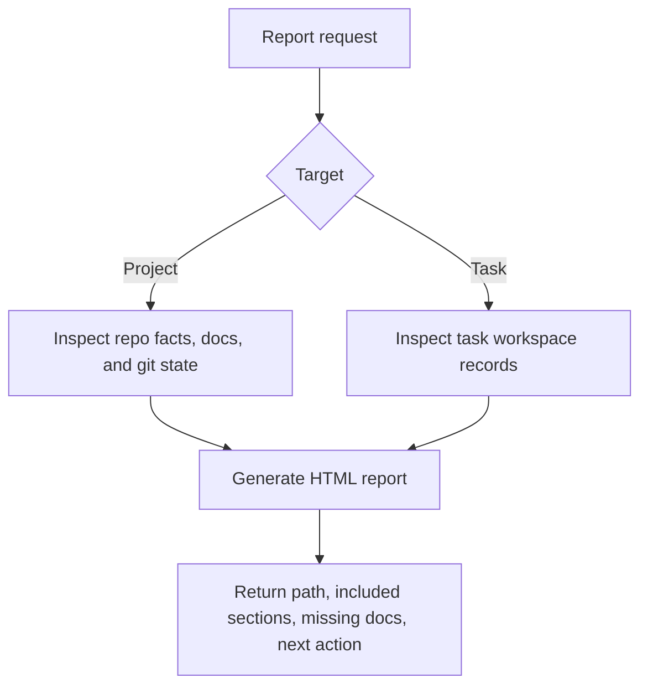
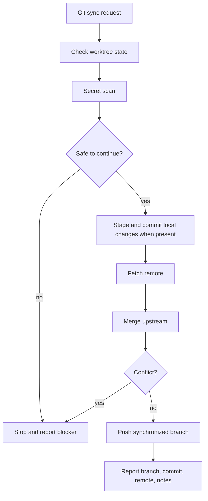

# Dev Baseline

> Agent-native standard development workflow baseline for Claude Code and Codex.

[中文文档](./README_CN.md) · [Command Map](./docs/COMMAND_MAP.md) · [Scenario Guide](./docs/SCENARIO_GUIDE.md) · [License](./LICENSE)

Dev Baseline turns AI-assisted coding into a documented, reviewable, team-style delivery workflow.

Visible skill commands stay intentionally focused:

```text
/dev-baseline
/dev-baseline-task
/dev-baseline-report
/dev-baseline-git-sync
```

Everything else is routed through `/dev-baseline` with repository scripts, references, and task records.

---

## Main Commands

| Command | Use it for |
|---|---|
| `/dev-baseline` | General workflow: init, review, planning, quality, Git, GitHub/GitLab, sprint, release, metrics, dashboard |
| `/dev-baseline-task` | PM-led team delivery task workflow with minimal single-responsibility agents |
| `/dev-baseline-report` | Project and task reports |
| `/dev-baseline-git-sync` | Safe one-step Git sync: add, commit, fetch, merge, push |

---

## Skill Flow Diagrams

### `/dev-baseline`: general router



### `/dev-baseline-task`: PM-led team delivery



Living contract rule:

```text
Initial plan is the starting intent, not an immutable command.
Tactical changes are allowed.
Changes that affect FP, AC, architecture constraints, test scope, delivery risk, or final acceptance must be recorded as contract deltas in 14-change-request-log.md.
Final review uses the latest effective contract plus evidence.
```

### `/dev-baseline-report`: project or task report



### `/dev-baseline-git-sync`: safe Git sync



---

## Team Delivery Flow

Start real feature work with:

```text
/dev-baseline-task create v0.3.2 用户登录功能
```

During team delivery, the main agent interacts only with PM. PM controls specialist agents, records active/skipped rationale, manages readiness, and summarizes progress, risks, contract deltas, evidence, and results.

---

## General Operations Through `/dev-baseline`

Examples:

```text
/dev-baseline 提交并推送
/dev-baseline 检查 GitLab MR 和 Pipeline 状态
/dev-baseline 生成任务仪表盘
/dev-baseline 创建迭代 v0.3.9 sprint-1
/dev-baseline 创建发版计划 v0.4.0 rc1
/dev-baseline 生成项目指标
/dev-baseline 运行质量门禁
```

No separate visible skill command is required for these, except the dedicated Git sync shortcut.

---

## Git Sync Shortcut

Use this when you want the local branch and remote branch synchronized in one step:

```text
/dev-baseline-git-sync
```

It runs the safe sequence:

```text
git add -A -> git commit -> git fetch/pull remote -> git merge upstream -> git push
```

The shortcut stops on suspicious secret files, unfinished merges/rebases, or merge conflicts. It never force-pushes.

---

## Reports

```text
/dev-baseline-report
/dev-baseline-report docs/tasks/<task-folder>
```

Reports are generated as HTML by default for better navigation and readability.

---

## Install

Dev Baseline ships one standard skill package under `skill/`. Codex and Claude Code install the same package; only the destination directory differs.

Personal installs replace the existing `dev-baseline` skill directory with a fresh copy and back up old Dev Baseline standalone entrypoints such as `dev-baseline-git-sync`, so duplicated commands do not remain after reinstall.

The `codex/` and `claude/` directories are thin adapter notes only. Shared skills, agents, hooks, references, and templates live in `skill/`.

Codex personal skill:

```bash
bash scripts/install-dev-baseline.sh codex
```

Claude Code personal skill:

```bash
bash scripts/install-dev-baseline.sh claude
```

Both personal skill directories:

```bash
bash scripts/install-dev-baseline.sh both-personal
```

Project overlay for Codex:

```bash
bash scripts/install-dev-baseline.sh codex-project /path/to/project
```

Project overlay for both Codex and Claude Code:

```bash
bash scripts/install-dev-baseline.sh both-project /path/to/project
```

Validate:

```bash
bash scripts/validate-skill.sh
```

---

## Best For

- Claude Code users
- Codex users
- solo developers who want structure
- small teams that need auditable PM-led role records without unnecessary agents
- long-running projects where context loss and scope drift are common

---

## License

MIT
