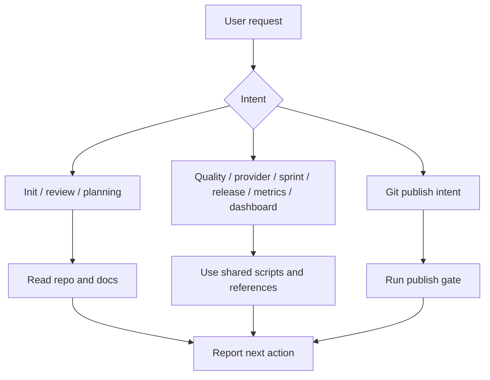
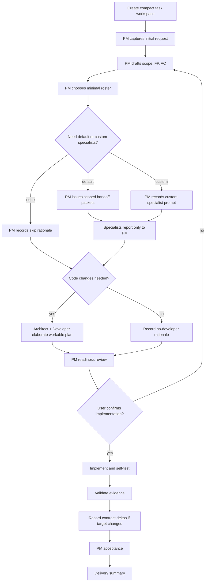
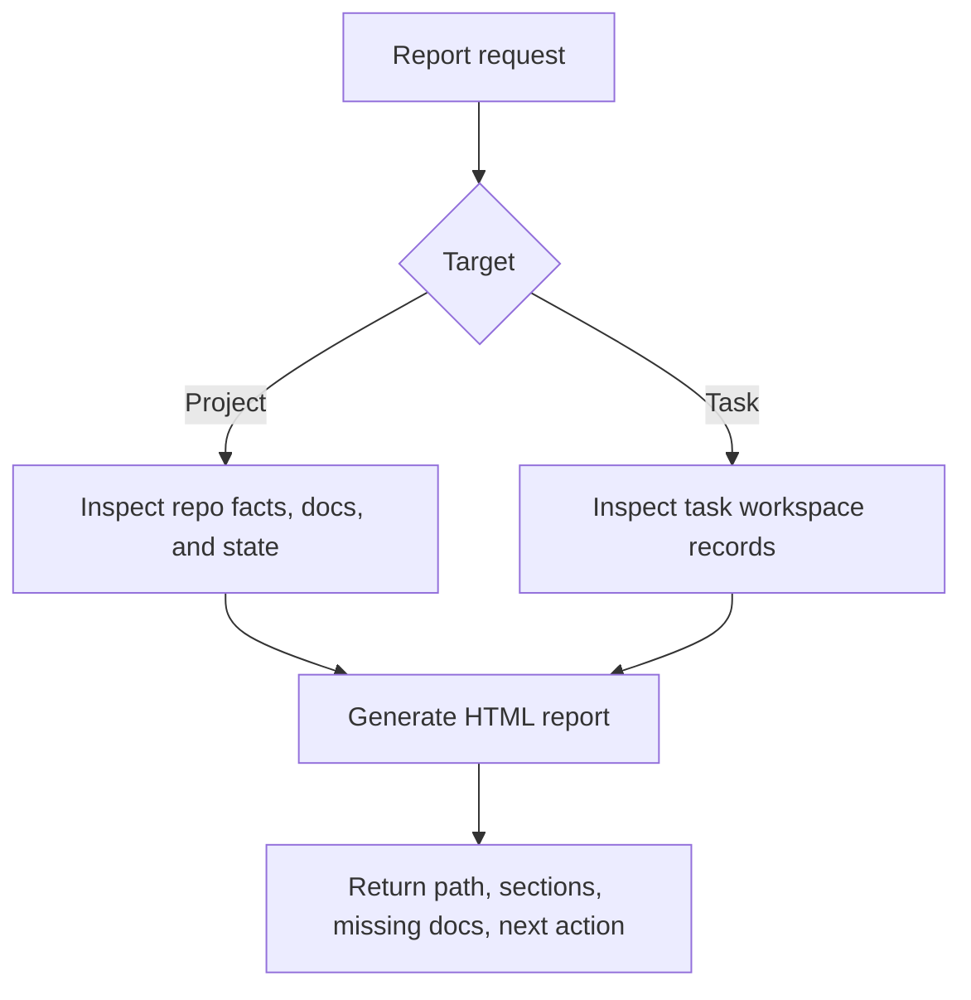
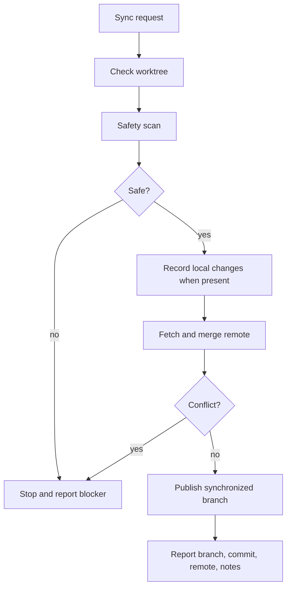

# Dev Baseline

> Agent-native standard development workflow baseline for Claude Code and Codex.

[中文文档](./README_CN.md) · [Command Map](./docs/COMMAND_MAP.md) · [Scenario Guide](./docs/SCENARIO_GUIDE.md) · [License](./LICENSE)

Dev Baseline turns AI-assisted coding into a documented, reviewable, PM-led delivery workflow.

Visible skill commands:

```text
/dev-baseline
/dev-baseline-task
/dev-baseline-report
/dev-baseline-git-sync
```

## Main Commands

| Command | Use it for |
|---|---|
| `/dev-baseline` | General routing: init, review, planning, quality, Git, providers, sprint, release, metrics, dashboard |
| `/dev-baseline-task` | PM-led team delivery with compact task records and minimal or custom agents |
| `/dev-baseline-report` | Project and task reports |
| `/dev-baseline-git-sync` | Safe one-step local/remote synchronization |

## v0.3.0 Highlights

- Compact team task workspace: `00-index.md` plus `01-07` task records.
- PM-led dynamic roster with default specialists and PM-defined custom specialists.
- One-line requirements can start intake, but implementation requires Architect + Developer elaboration when code changes are needed.
- Living Contract rule: tactical changes are allowed; target-changing deltas are recorded in `05-governance-log.md`.
- Compact-first readiness, traceability, report, dashboard, metrics, and status scripts.

## Skill Flow Diagrams

### `/dev-baseline`: general router



### `/dev-baseline-task`: PM-led team delivery



Living contract rule:

```text
Initial plan is the starting intent, not an immutable command.
Tactical changes are allowed.
Target-changing changes are recorded as contract deltas in 05-governance-log.md.
Final review uses the latest effective contract plus evidence.
```

Compact team task documents:

| File | Purpose |
|---|---|
| `00-index.md` | Entry, status, next action |
| `01-task-contract.md` | Scope, FP, AC, latest target |
| `02-delivery-plan.md` | Architecture, implementation, self-test, rollback |
| `03-work-log.md` | Agent roster, custom prompts, handoffs, feature status, implementation, bugfix |
| `04-validation.md` | Test plan, results, evidence, retest |
| `05-governance-log.md` | Decisions, contract deltas, risks |
| `06-readiness-acceptance.md` | Readiness gate, user confirmation, PM acceptance |
| `07-delivery-summary.md` | Stage report, delivered scope, follow-up |

### `/dev-baseline-report`: project or task report



### `/dev-baseline-git-sync`: safe sync



## Start a Team Delivery Task

```text
/dev-baseline-task create v0.3.0 用户登录功能
```

During team delivery, the main agent interacts only with PM. PM controls specialists, may define custom specialists when needed, ensures one-line requests are elaborated into workable plans before implementation, and owns readiness, contract deltas, validation evidence, risks, and acceptance.

## Install

```bash
bash scripts/install-dev-baseline.sh codex
bash scripts/install-dev-baseline.sh claude
bash scripts/install-dev-baseline.sh both-personal
bash scripts/install-dev-baseline.sh codex-project /path/to/project
bash scripts/install-dev-baseline.sh both-project /path/to/project
```

Validate:

```bash
bash scripts/validate-skill.sh
```

## License

MIT
