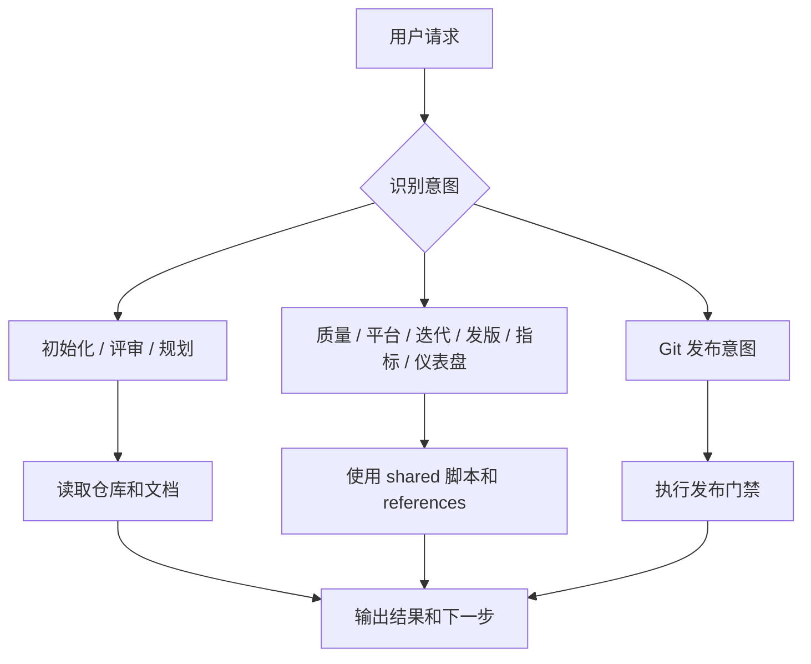
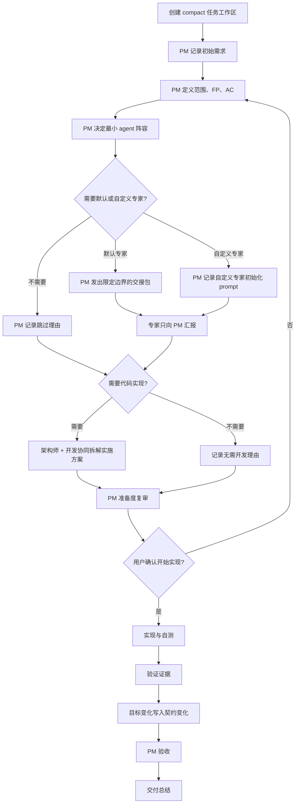
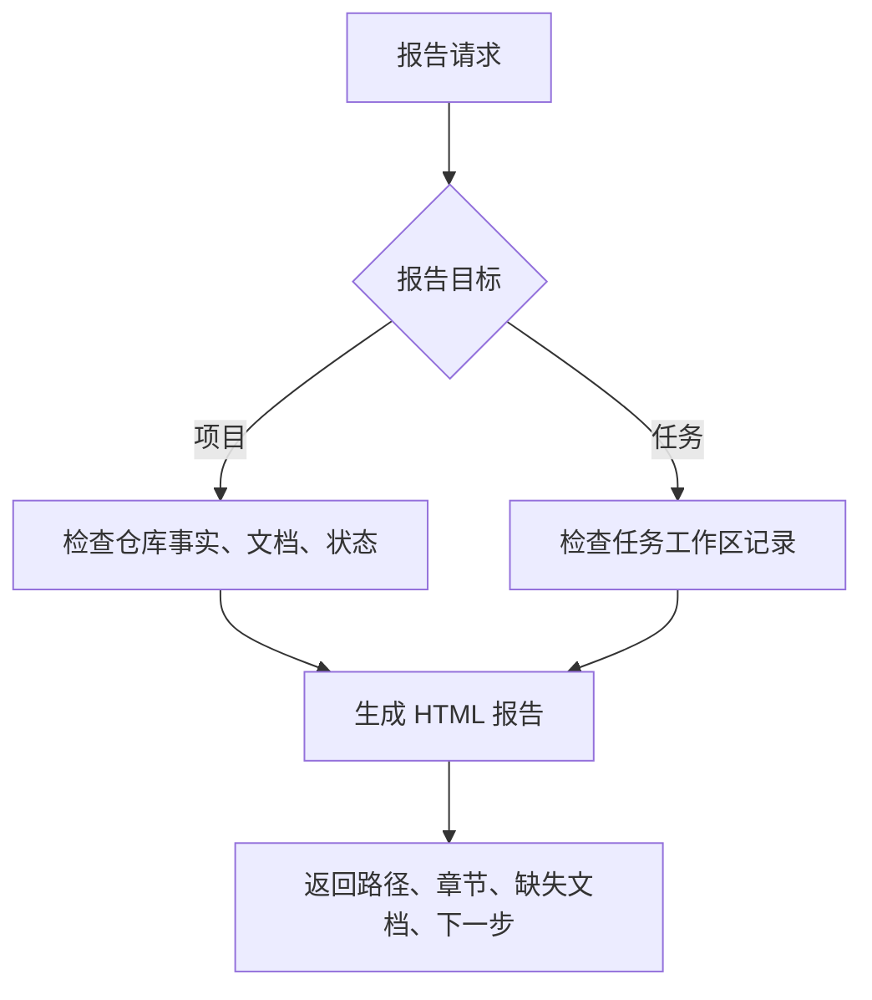
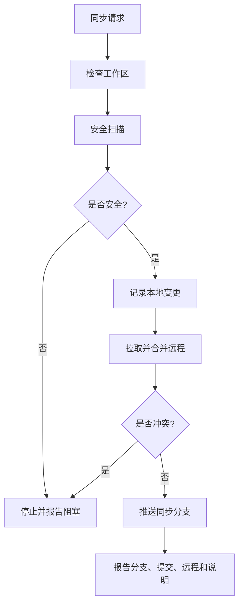

# Dev Baseline

> 面向 Claude Code 和 Codex 的 agent-native 标准开发流程基线。

[English README](./README.md) · [命令地图](./docs/COMMAND_MAP_CN.md) · [场景手册](./docs/SCENARIO_GUIDE.md) · [许可证](./LICENSE)

Dev Baseline 把 AI 辅助开发变成一套可记录、可审查、可验收的 PM 主导交付流程。

可见 skill 命令：

```text
/dev-baseline
/dev-baseline-task
/dev-baseline-report
/dev-baseline-git-sync
```

## 主要命令

| 命令 | 用途 |
|---|---|
| `/dev-baseline` | 通用路由：初始化、评审、规划、质量、Git、平台、迭代、发版、指标、仪表盘 |
| `/dev-baseline-task` | PM 主导团队交付，使用 compact 任务记录，可按需启用默认或自定义 agent |
| `/dev-baseline-report` | 项目和任务报告 |
| `/dev-baseline-git-sync` | 安全的一键本地/远程同步 |

## Skill 流程图

### `/dev-baseline`：通用路由入口



### `/dev-baseline-task`：PM 主导团队交付



动态契约规则：

```text
初始计划是任务意图，不是不可变命令。
实施方可以独立调整战术细节。
影响 FP、AC、架构约束、测试范围、交付风险或最终验收的变化，记录到 05-governance-log.md。
最终复核看最新生效契约和证据。
```

Compact 团队任务文档：

| 文件 | 作用 |
|---|---|
| `00-index.md` | 入口、状态、下一步 |
| `01-task-contract.md` | 范围、FP、AC、最新目标 |
| `02-delivery-plan.md` | 架构、实现、自测、回滚 |
| `03-work-log.md` | Agent 阵容、自定义 prompt、交接、功能状态、实现、修复 |
| `04-validation.md` | 测试计划、结果、证据、复测 |
| `05-governance-log.md` | 决策、契约变化、风险 |
| `06-readiness-acceptance.md` | 准备门禁、用户确认、PM 验收 |
| `07-delivery-summary.md` | 阶段报告、交付范围、后续事项 |

### `/dev-baseline-report`：项目或任务报告



### `/dev-baseline-git-sync`：安全同步



## 开始团队交付任务

```text
/dev-baseline-task create v0.3.2 用户登录功能
```

团队模式下，主 agent 只和 PM 交互。PM 控制专家，可以按需定义自定义专家；一句话需求可以进入 intake，但实现前必须由 PM 组织架构师和开发把需求拆成可执行方案。PM 负责准备度、契约变化、验证证据、风险和验收。

## 安装

```bash
bash scripts/install-dev-baseline.sh codex
bash scripts/install-dev-baseline.sh claude
bash scripts/install-dev-baseline.sh both-personal
bash scripts/install-dev-baseline.sh codex-project /path/to/project
bash scripts/install-dev-baseline.sh both-project /path/to/project
```

校验：

```bash
bash scripts/validate-skill.sh
```

## License

MIT
