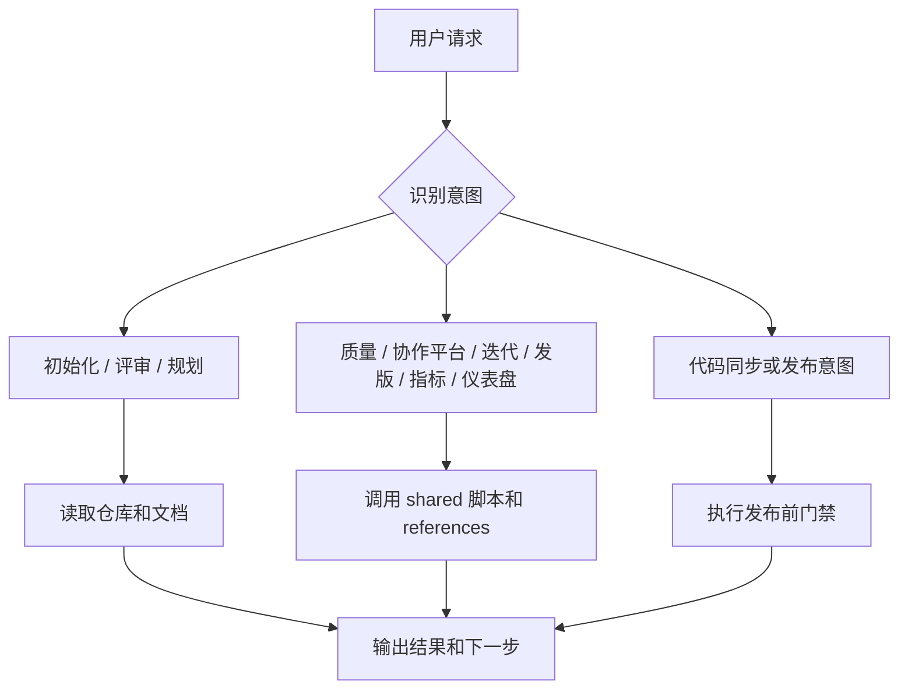
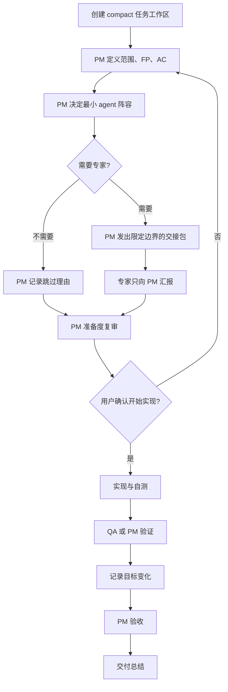
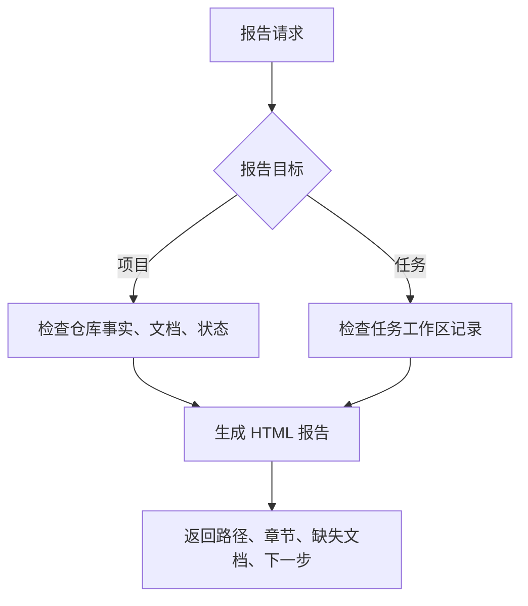
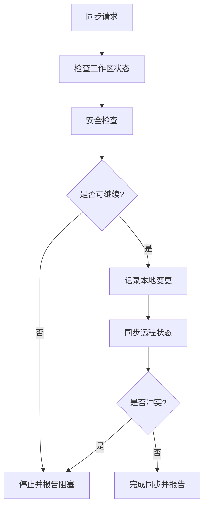

# Dev Baseline

> 面向 Claude Code 和 Codex 的 agent-native 标准开发流程基线。

[English README](./README.md) · [命令地图](./docs/COMMAND_MAP_CN.md) · [场景手册](./docs/SCENARIO_GUIDE.md) · [许可证](./LICENSE)

Dev Baseline 把 AI 辅助开发变成一套可记录、可审查、可验收的团队交付流程。

可见 skill 命令保持聚焦：

```text
/dev-baseline
/dev-baseline-task
/dev-baseline-report
/dev-baseline-git-sync
```

其他能力都通过 `/dev-baseline` 主入口和仓库里的脚本、规则文档、任务记录来路由。

---

## 主要命令

| 命令 | 用途 |
|---|---|
| `/dev-baseline` | 通用流程：初始化、评审、规划、质量检查、Git、GitHub/GitLab、迭代、发版、指标、仪表盘 |
| `/dev-baseline-task` | PM 主导的团队任务流程，按需启用最少的单一职责 agent |
| `/dev-baseline-report` | 项目和任务报告 |
| `/dev-baseline-git-sync` | 安全的一键 Git 同步 |

---

## Skill 流程图

### `/dev-baseline`：通用路由入口



### `/dev-baseline-task`：PM 主导团队交付



动态契约规则：

```text
初始计划是任务意图，不是不可变命令。
实施方可以独立调整战术细节。
影响 FP、AC、架构约束、测试范围、交付风险或最终验收的变化，记录到 05-governance-log.md。
最终复核看最新生效契约和证据。
```

Compact 团队任务文档：

| 文件 | 作用 |
|---|---|
| `00-index.md` | 入口、状态、下一步 |
| `01-task-contract.md` | 范围、FP、AC、最新目标 |
| `02-delivery-plan.md` | 架构、实现、自测、回滚 |
| `03-work-log.md` | Agent 阵容、交接、功能状态、实现、修复 |
| `04-validation.md` | 测试计划、结果、证据、复测 |
| `05-governance-log.md` | 决策、契约变化、风险 |
| `06-readiness-acceptance.md` | 准备门禁、用户确认、PM 验收 |
| `07-delivery-summary.md` | 阶段报告、交付范围、后续事项 |

### `/dev-baseline-report`：项目或任务报告



### `/dev-baseline-git-sync`：安全同步



---

## 标准团队开发流程

真实需求从这里开始：

```text
/dev-baseline-task create v0.3.2 用户登录功能
```

团队模式下，主 agent 只和 PM 交互。PM 控制专业 agent，记录启用/跳过理由、准备门禁、动态契约变化、测试证据、风险和验收结果。

---

## 通过 `/dev-baseline` 执行通用操作

示例：

```text
/dev-baseline 提交并推送
/dev-baseline 检查 GitLab MR 和 Pipeline 状态
/dev-baseline 生成任务仪表盘
/dev-baseline 创建迭代 v0.3.9 sprint-1
/dev-baseline 创建发版计划 v0.4.0 rc1
/dev-baseline 生成项目指标
/dev-baseline 运行质量门禁
```

这些能力不需要单独暴露 skill 命令；完整代码同步使用专用入口。

---

## Git 一键同步

```text
/dev-baseline-git-sync
```

遇到敏感文件、未完成合并/变基或冲突时会停止。

---

## 报告

```text
/dev-baseline-report
/dev-baseline-report docs/tasks/<task-folder>
```

报告默认生成 HTML，更适合阅读和导航。

---

## 安装

Dev Baseline 使用 `skill/` 作为同一套标准 skill 包。Codex 和 Claude Code 安装的是同一份内容，只是目标目录不同。

`codex/` 和 `claude/` 目录只保留轻量适配说明。共享的 skills、agents、hooks、references 和 templates 都放在 `skill/`。

Codex 个人 skill：

```bash
bash scripts/install-dev-baseline.sh codex
```

Claude Code 个人 skill：

```bash
bash scripts/install-dev-baseline.sh claude
```

同时安装到两个个人目录：

```bash
bash scripts/install-dev-baseline.sh both-personal
```

Codex 项目级 overlay：

```bash
bash scripts/install-dev-baseline.sh codex-project /path/to/project
```

Codex + Claude Code 项目级 overlay：

```bash
bash scripts/install-dev-baseline.sh both-project /path/to/project
```

校验：

```bash
bash scripts/validate-skill.sh
```

---

## 适合谁

- Claude Code 用户
- Codex 用户
- 想要结构化流程的独立开发者
- 需要可审计 PM 主导角色记录、但不想无意义拉满 agent 的小团队
- 容易上下文丢失、范围漂移的长期项目

---

## License

MIT
